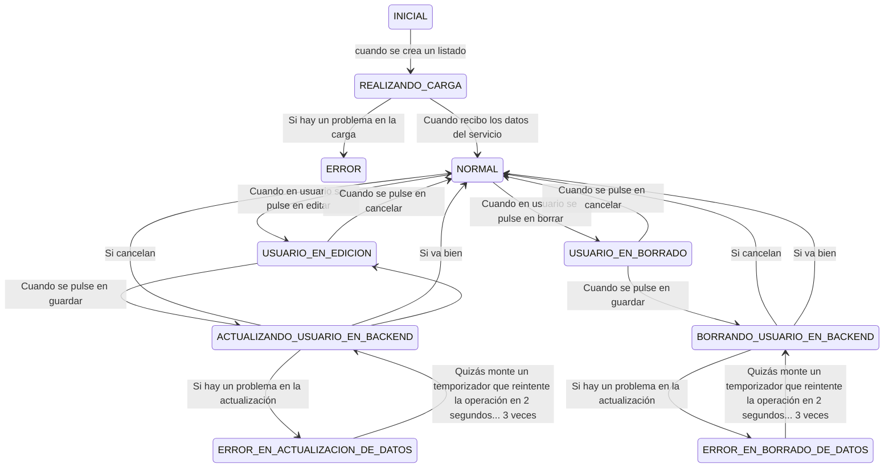

# Comunicaciones entre componentes:

Los componentes WEB que cree, deben ser componente totalmente independientes (DESACOPLADOS):
CUALQUIER COMUNICACION ENTRE COMPONENTES DEBO HACERLA SIEMPRE (BAJO PENA DE MUERTE) mediante:
- Atributos HTML (padre-hijo)
- Eventos (hijo/padres)

No accedemos a propiedades NUNCA de los componentes desde otros !!!! = CAGARLA: ACOPLO COMPONENTES
Para eso he definido un API en mi componente! Input / Output

---

# Componente listado de usuarios

<listado-usuarios
    buscador="true"
    usuariosBorrables="true"
    usuariosEditables="true">
</listado-usuarios>

    Buscador | escriba algo aquí  |

    Felipe García       [Borrar] [Editar]
    Menchu Hernandez    [Borrar] [Editar]
    Federico Ruiz       [Borrar] [Editar]
                        ^ Cuando le saco la accion confirmable de borrar: 
                            - usuariosBorrables en true
                            - listado esté en estado normal
                            - o cuando estando en estado USUARIO_EN_BORRADO
                              el usuario que se esté borrando sea Federico 

Vamos a hacer que nuestro listado-usuarios solicite los datos de los usuarios que debe mostrar a quién? ServicioDeUsuarios

## Estados de este componente

El buscador debe mostrarse solo cuando el listado esté en estado NORMAL

Dentro del componente:
- Listado de Todos los usuarios que me haya devuelto el servicio
- Listado de los usuarios que mostramos en pantalla en un momento dado... Éste se genera mediante un filtrado del anterior.

---

En la realidad

ERROR_EN_ACTUALIZACION_DE_DATOS:
    No hemos podido comunicar con el backend... vamos intentarlo de nuevo en 5seg [CANCELAR] [Volver al formulario]