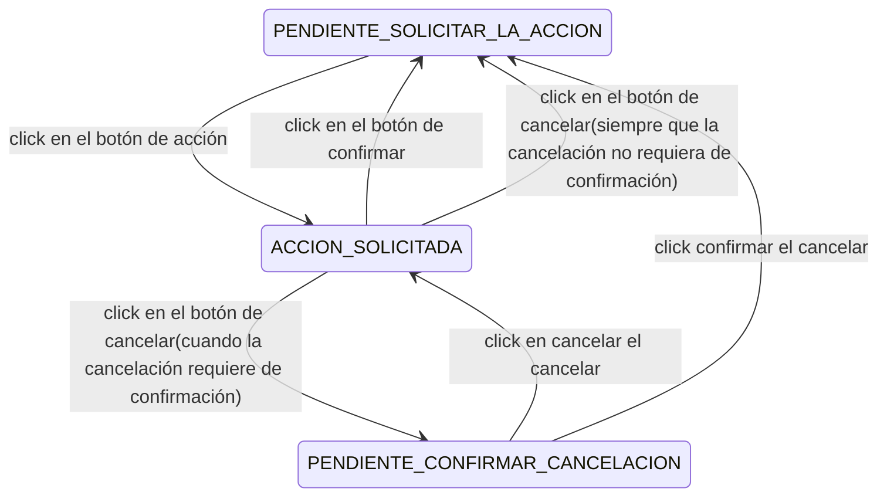

# < accion-confirmable >

## Inputs

| Input   | type    | default |
| ------- | :-----: | ------- |
| caption | String  | Ninguno |
| captionConfirmar | String  | `"Aceptar"` |
| captionCancelar | String  | `"Cancelar"`  |
| activateConfirmationButton | boolean | true |
| confirmableCancelationButton | boolean | false |

## Eventos

| Outputs | Descripción |
| ------- | - |
| onAccionSolitada | Cuando se apreta en el botón con texto: `caption` |
| onAccionConfirmada | Cuando se apreta en el botón con texto: `captionConfirmar` |
| onAccionCancelada | Cuando se apreta en el botón con texto: `captionCancelar` |

## Estados



## Uso

```html
<accion-confirmable
    caption="Editar"
    captionConfirmar="Guardar"
    captionCancelar="Cancelar"
    activateConfirmationButton="true"
    confirmableCancelationButton="true"
    onAccionSolitada="EVENTO"
    onAccionConfirmada="EVENTO"
    onAccionCancelada="EVENTO"
>
```

        [Editar] * click   -->       [ Guardar ]  [ Cancelar ]
    DATOS DE UN USUARIO    -->       FORMULARIO CON LOS DATOS DE UN USUARIO (padre)
                                        Si no he tocado anda... el botón de Guardar debe estar Desactivado
                                                                el botón de cancelar debe estar Activo... y si le pincho: Se cancela... Aviso al padre y yo vuelvo a sacar qué botón?  [ Editar ]
                                        Y si he tocado algo?... el botón de Guardar debe estar Activo
                                                                el botón de cancelar debe estar activo... y si le doy: Otra confirmación!
                                                                Es decir... en este caso el botón cancelar es OTRA acción confirmable

        [Editar] * click   -->       [ Guardar ]  [ Cancelar ] * click      ->        [Confirmar cancelación]  [Cancelar cancelación]
         ^ desaparece al                ^ desaparece al 
         hacer click en editar          hacer click en cancelar
