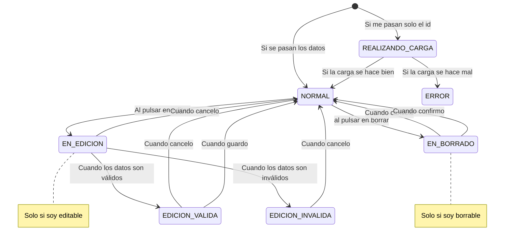

# Componente <usuario>

Este componente está regido por una máquina de estados.

En función del estado en que el componente se encuentre, así será la representación gráfica del componente.

El componente debe definir todas esas acciones: CAMBIOS DE ESTADO.
Voy a generar eventos para todas esas acciones (flechas)